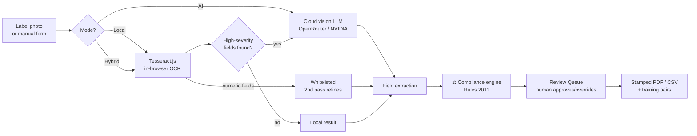

<div align="center">

# ⚖️ LMCC — Legal Metrology Compliance Checker

### AI-powered compliance auditing for Indian packaged-commodity labels

[](https://nextjs.org)
[](https://www.typescriptlang.org)
[](https://github.com/naptha/tesseract.js)
[](https://www.sih.gov.in)
[](#-author)

*Verify any product label against the **Legal Metrology (Packaged Commodities) Rules, 2011** —
by scanning it with OCR + AI, or auditing it manually. Built for sellers, FPOs, and
compliance officers who need an answer in seconds, not hours.*

**SIH26034 · Dept. of Consumer Affairs, Government of India**

</div>

## Credits

- [Kurakula Jahnavi | LinkedIn](https://www.linkedin.com/in/kurakula-jahnavi/)
- [Venkata Kasinagaraju Kurra | LinkedIn](https://www.linkedin.com/in/venkata-kasinagaraju-kurra-1b703838b/)
- [Ranganayakulu Kottamasu | LinkedIn](https://www.linkedin.com/in/ranganayakulu-kottamasu-711533362/)
- [Abhinav Datta | LinkedIn](https://www.linkedin.com/in/abhinav-datta-kaly/)
- L. Swathi Sree
- T. Lavanya

---

## 📖 Table of Contents

- [What is LMCC?](#-what-is-lmcc)
- [✨ Features](#-features)
- [🔧 How It Works](#-how-it-works)
- [🚀 Run It Locally](#-run-it-locally)
- [🔐 Accounts, Roles & Security](#-accounts-roles--security)
- [🤖 Connecting Free AI Providers](#-connecting-free-ai-providers)
- [🎯 Train Your Own OCR Model](#-train-your-own-ocr-model)
- [🪶 Lite Mode (low-memory devices)](#-lite-mode-low-memory-devices)
- [⌨️ Keyboard Shortcuts](#️-keyboard-shortcuts)
- [📁 Project Structure](#-project-structure)
- [📚 Documentation](#-documentation)
- [👤 Author](#-author)

---

## 🧐 What is LMCC?

Every retail package in India must declare its manufacturer, net quantity, MRP,
dates, and customer-care details under the **Legal Metrology (Packaged Commodities)
Rules, 2011**. Manually checking a label against those rules is slow and error-prone.

**LMCC** closes that gap:

1. 📸 **Scan** a product label photo (or fill the manual audit form)
2. 🔍 **OCR + optional AI vision** extract every mandatory declaration
3. ⚖️ The **rules engine** evaluates each field against specific rules
4. 👤 A human **reviews** low-confidence fields in the Review Queue
5. 📄 **Export** a stamped, print-ready compliance report (PDF/CSV)

Everything runs in a single Next.js app. Scans sync to your account so the same
login works from **any device**.

---

## ✨ Features

| | Feature | Details |
|---|---|---|
| 📷 | **Three OCR modes** | `Local` (Tesseract in your browser, zero data leaves the device) · `AI` (cloud vision LLM) · `Hybrid` (**default** — local first, AI fallback only for high-severity fields) |
| ⚡ | **Zero-config AI** | One provisioned vision model (`meta/llama-3.2-11b-vision-instruct` on NVIDIA) works for **every user out of the box** — its key is held server-side, AES-encrypted in Supabase; every other model stays bring-your-own-key |
| ⚖️ | **Rules engine** | Field-level verdicts (`compliant / needs_review / missing / non_compliant`) with rule references, severity, and human-readable notes |
| 🔢 | **Character whitelisting** | Second, targeted OCR pass restricted to valid characters for MRP (incl. `₹`), net quantity, and dates — kills "8"→"B" misreads |
| 🧾 | **Product Declarations Audit** | Manual entry form with a live compliance preview — audit a product without any photo at all |
| ✏️ | **Edit anything, anywhere** | Review Queue overrides, and full **Edit** from Scan History that re-runs the engine and updates the scan in place |
| 👥 | **Roles** | *Seller* (upload & audit products) and *Compliance Officer / Admin* (everything + Review Queue + Legal Reference) |
| 🔄 | **Cross-device sync** | Accounts and scans live server-side (Supabase Postgres) — sign in anywhere and your history is there |
| 🔒 | **Privacy-first security** | Raw passwords never leave the browser (client-derived PBKDF2 verifier), PII encrypted at rest (AES-256-GCM), httpOnly session cookies |
| 🔐 | **Full account security** | Authenticator-app 2FA (QR, server-generated) with 10 single-use backup codes · forgot-password via security questions (single-use tickets, all other devices logged out) · change-password from Settings |
| 📊 | **Dashboard** | Live compliance stats, recent scans, and violation breakdowns |
| 📄 | **Stamped exports** | PDF (formatted report w/ tables & page furniture) and CSV — every export records *who* produced it (name · employee ID · email) |
| 📬 | **Honest contact form** | Composes a pre-filled GitHub issue (with browser/device diagnostics attached) in a new tab — nothing is stored on the site, nothing sends without an explicit GitHub action |
| 🎯 | **Self-improving OCR** | Reviewer corrections are captured (opt-in) as labeled training pairs and export straight into the training pipeline |
| 🪶 | **Lite Mode** | Auto-detects low-RAM devices (≤2GB / ≤2 cores) and trims canvas sizes, animations, and the custom cursor |
| ♿ | **Accessible** | Skip link, visible focus rings, `prefers-reduced-motion` support, full keyboard navigation (`Alt+1…7`, `Alt+K` cheat sheet), mobile-first responsive layout |
| 🌗 | **Dark / light theme** | System-aware with a manual toggle |
| 🥚 | **Easter eggs** | Konami code → secret Snake arcade · 404 rickroll · clickable logo & credits · DevTools console greeting |

---

## 🔧 How It Works



**The compliance engine** (`src/lib/compliance-rules.ts`) holds one check per
mandatory field — MRP formatting, net-quantity units, date presence, manufacturer
identity, importer declarations for imported items, consumer-care details, and more.
Each check returns a status, the rule reference (e.g. *Rule 6(1)(a)*), severity, and
an explanation that lands in the report and the reviewer's queue.

---

## 🚀 Run It Locally

### Prerequisites

| Requirement | Version | Notes |
|---|---|---|
| **Node.js** | 18+ (20 recommended) | [nodejs.org](https://nodejs.org) |
| **Git** | any | to clone |

`npm` is the project's package manager (lockfile committed); `bun`/`pnpm` also work.

### Install & run

```bash
# 1 · Clone
git clone https://github.com/abhinavdatta/SIH-SIH26034.git
cd SIH-SIH26034

# 2 · Install dependencies
npm install

# 3 · Start (no env vars needed — the app runs on a local file backend)
npm run dev
```

Open **http://localhost:3000** → create an account (pick a role) → scan a label
from `training/images/` or audit a product manually. AI/hybrid OCR works
immediately via the built-in default model.

<details>
<summary><b>Environment variables</b> (click to expand — all optional locally)</summary>

```env
# Application URL
NEXT_PUBLIC_APP_URL=http://localhost:3000

# ── Durable backend (production) ──
# Supabase Postgres via the Data API: accounts, sessions, scans, settings.
# Free tier at supabase.com → project Settings → API.
SUPABASE_URL=
SUPABASE_SERVICE_ROLE_KEY=   # service_role secret — server-side ONLY, never expose

# Server pepper: encrypts user PII + HMACs email lookups. Generate:
#   node -e "console.log(require('crypto').randomBytes(32).toString('hex'))"
AUTH_PEPPER=

# ── Built-in default AI provider (optional) ──
# Lets AI/hybrid OCR work with zero personal key for ONE provisioned model
# (meta/llama-3.2-11b-vision-instruct on NVIDIA). On first use the server
# encrypts this key into Supabase lmcc_settings and reads only the envelope
# afterwards. Without it (and without the Supabase row), AI/hybrid require
# each user to bring their own key.
DEFAULT_AI_PROVIDER_KEY=
```

> Personal AI-provider keys are **not** env vars — they're configured per-user
> in the app's **AI Providers** screen and never leave that browser.

**Supabase migrations** (run once in the SQL Editor, in order):
`supabase/migrations/0001_lmcc_auth.sql` → `0002_account_security.sql` →
`0003_default_ai_provider.sql`. All are idempotent.
</details>

<details>
<summary><b>Production build</b></summary>

```bash
npm run build
npm start
```

Deploy target: **Vercel** (Hobby plan works — functions use Fluid compute's
300s allowance for vision scans). See [docs/SETUP.md](docs/SETUP.md) for the
deployment checklist.
</details>

---

## 🔐 Accounts, Roles & Security

**Two roles at sign-up:**

| Role | Gets |
|---|---|
| 🏪 **Seller** | Dashboard · Scan Product · Scan History (view/edit) · Product Audit · AI Providers · Settings |
| 🛡️ **Compliance Officer / Admin** | Everything above **plus** Review Queue (approve/override OCR fields) and the full Legal Reference |

**Same login on every device** — accounts, sessions, and scans live server-side.
Sign out on a shared machine wipes only that browser's cache; the account copy is
safe and re-hydrates at the next sign-in.

**Built-in guardrails** (because plaintext credentials are how projects end up on
the news):

- 🔑 **The raw password never leaves the browser.** The client derives a
  PBKDF2-SHA256 verifier (150k iterations, per-user salt) and sends only that —
  open the network tab and you'll see an opaque blob, never a password. The server
  then scrypt-hashes the verifier again before storing (DB leak ≠ replayable login).
- 🧊 **PII encrypted at rest.** Name/email/employee ID are AES-256-GCM encrypted
  with a key derived from `AUTH_PEPPER`; email lookups use an HMAC index — a
  database dump without the env secret reveals no user PII.
- 🔐 **Authenticator 2FA (TOTP)** — QR generated server-side (no third-party
  image service ever sees the secret), plus **10 single-use backup codes**
  (stored as SHA-256 hashes) so a lost phone isn't a lockout.
- 🛟 **Forgot password** via three security questions — single-use 15-minute
  tickets stored as hashes, max 5 attempts, identical responses whether or not
  an account exists, and **every other device gets logged out** after a reset.
- 🍪 **httpOnly session cookies** (SameSite=Lax) — no tokens in localStorage for
  XSS to steal.
- 🐢 **Timing-safe comparison** + deliberately vague sign-in errors (no user
  enumeration) + durable per-IP/email rate limiting (Supabase RPC).
- 🗄️ **Durable backend:** Supabase Postgres (service-role, RLS deny-all on every
  table) with a local file fallback for offline development.

---

## 🤖 AI Providers

**You don't need a key to start.** One vision model is provisioned for everyone:

> `meta/llama-3.2-11b-vision-instruct` (NVIDIA NIM) — its key lives server-side
> (AES-256-GCM encrypted in Supabase `lmcc_settings`), never reaches browsers,
> and shared use is rate-limited (10 scans/min per IP). AI and Hybrid modes work
> immediately; the Scan Product and AI Providers screens show the
> "Built-in default active" banner.

**Bring your own key** for everything else:

1. Open **AI Providers** in the sidebar
2. Pick a preset (OpenRouter & NVIDIA NIM included) or **Add Custom Provider**
3. Paste your key → **Test connection** → Save → enable the toggle
4. Your key is stored only in *your* browser and sent only to *our* SSRF-guarded
   API route, which relays to the provider — the key never touches anyone else's server

Each field has a *"Where do I find these?"* helper with concrete examples, and the
app links to [awesome-freellm-apis](https://github.com/open-free-llm-api/awesome-freellm-apis)
— a curated catalogue of free LLM APIs and their key signup pages.

No internet at all? Everything still works in **Local mode** — Tesseract runs
entirely in your browser.

---

## 🎯 Train Your Own OCR Model

The stock Tesseract model is decent; **yours will be better on your labels**.
The `training/` folder is a complete fine-tuning pipeline for a Tesseract 5 LSTM:

```
training/
├── images/                 ← put your label photos here
├── ground-truth/           ← generated .png + .gt.txt line pairs (review these!)
├── models/                 ← output: labelnet.traineddata
├── scripts/prepare_ground_truth.py
├── colab_train_ocr.ipynb   ← one-click Google Colab training (recommended)
└── train_local.sh          ← local training with tesstrain (WSL/Linux/macOS)
```

**The short version:**

```bash
# 1 · Drop 10–50 label photos into training/images/
# 2 · Generate + review ground truth
pip install Pillow numpy
python training/scripts/prepare_ground_truth.py
#    ⚠️ manually fix every .gt.txt — errors here are taught to the model

# 3 · Train (either path)
#    A) Google Colab: upload training/colab_train_ocr.ipynb → Run all
#    B) Local: bash training/train_local.sh   (needs tesstrain)

# 4 · Deploy
cp training/models/labelnet.traineddata public/tessdata/
```

**Free data, forever:** every human correction made in the Review Queue can be
captured (opt-in, off by default, stored only on-device, 7-day expiry) as a
labeled image+text pair. Settings → **Export training ZIP** packages them in the
exact `tesstrain` layout — drop straight into `training/ground-truth/`.

Full walkthrough: [training/README.md](training/README.md)

---

## 🪶 Lite Mode (low-memory devices)

Settings → **Performance** → *Auto / On / Off*.

- **Auto** (default) activates only on constrained devices (`navigator.deviceMemory ≤ 2GB` or `≤ 2 CPU cores`); capable machines stay in full fidelity
- Trims: custom cursor rAF loop, animations/transitions, smooth scrolling, and — where it really matters — **OCR canvas size** (2000px → 900px, ~4–5× less peak canvas RAM) plus the AI-upload downscale

---

## ⌨️ Keyboard Shortcuts

| Keys | Action |
|---|---|
| `Alt + 1…7` | Jump to Dashboard / Scan / Review / History / Legal / AI Providers / Settings |
| `Alt + K` | Keyboard shortcuts cheat sheet |
| `Tab` | Skip link → *"Skip to main content"* |
| `↑ ↓` arrows | Navigate the sidebar |
| `↑↑↓↓←→←→BA` | 🥚 You found the arcade |

---

## 📁 Project Structure

```
SIH-SIH26034/
├── src/
│   ├── app/
│   │   ├── api/
│   │   │   ├── auth/                 # register / login / 2FA / reset / sessions
│   │   │   ├── scans/                # cross-device scan sync
│   │   │   ├── validate-api-key/     # provider key validation (SSRF-guarded)
│   │   │   └── vision-fallback/      # cloud OCR + built-in default provider
│   │   ├── globals.css               # design tokens + a11y + lite-mode CSS
│   │   ├── layout.tsx                # AuthProvider + theme + PWA manifest
│   │   ├── not-found.tsx             # branded 404 (with 🥚)
│   │   └── page.tsx                  # auth gate + view routing
│   ├── components/
│   │   ├── app/                      # Dashboard, UploadScan, ReviewQueue,
│   │   │                             # ProductHistory, ProductAudit, Report,
│   │   │                             # AIProviders, Settings, AuthPanel,
│   │   │                             # AccountSecurityCard, easter-eggs, …
│   │   └── ui/                       # shadcn/radix primitives
│   └── lib/
│       ├── auth.tsx                  # session context (client)
│       ├── auth-crypto.ts            # PBKDF2 client verifier
│       ├── server/auth-store.ts      # scrypt + AES-GCM credential store
│       ├── server/supabase-store.ts  # Postgres Data API access (service role)
│       ├── server/default-provider.ts# built-in AI model (encrypted key)
│       ├── server/totp.ts            # RFC 6238 2FA
│       ├── compliance-rules.ts       # ⚖️ the rules engine
│       ├── ocr.ts                    # Tesseract pipeline + whitelisting
│       ├── scan-sync.ts              # device ↔ server merge
│       ├── training-samples.ts       # review corrections → tesstrain ZIP
│       ├── lite-mode.ts              # low-memory detection
│       └── local-data.ts             # scan persistence (localStorage)
├── supabase/migrations/              # 0001 auth · 0002 security · 0003 settings
├── training/                         # OCR fine-tuning pipeline (see above)
├── docs/                             # SETUP, ARCHITECTURE, DEMO-VIDEO, …
├── images/                           # numbered demo screenshots (01–12)
├── scripts/                          # E2E suites + screenshot capture
└── public/tessdata/                  # WASM models incl. your fine-tuned one
```

---

## 📚 Documentation

| Doc | Contents |
|---|---|
| [docs/SETUP.md](docs/SETUP.md) | Install, env vars, Supabase + Vercel deployment checklist, troubleshooting |
| [docs/ARCHITECTURE.md](docs/ARCHITECTURE.md) | System design deep-dive |
| [docs/OCR_TRAINING.md](docs/OCR_TRAINING.md) · [training/README.md](training/README.md) | Model fine-tuning pipeline |
| [docs/AI_PROVIDERS.md](docs/AI_PROVIDERS.md) | Provider presets, built-in default & custom providers |
| [docs/OPENROUTER_GUARDRAILS.md](docs/OPENROUTER_GUARDRAILS.md) | SSRF protections & outbound-call safety |
| [docs/FEATURES.md](docs/FEATURES.md) | Complete feature list |
| [docs/DEMO-VIDEO.md](docs/DEMO-VIDEO.md) | Demo script + paste-ready voiceover blocks (with `images/` previews) |
| [docs/DEVELOPER_GUIDE.md](docs/DEVELOPER_GUIDE.md) | Contributing / extending the engine |

---

## 👤 Author

 **Smart India Hackathon 2026** — problem statement **SIH26034**,
Dept. of Consumer Affairs, Government of India.

<div align="center">

**[github.com/abhinavdatta](https://github.com/abhinavdatta)**

*Hackathon project — provided as-is, no warranty. Not legal advice; verify
compliance determinations against the official Rules text.*

</div>
